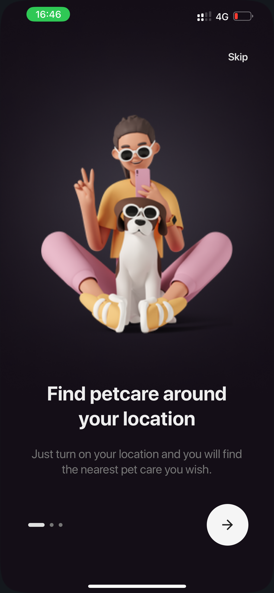
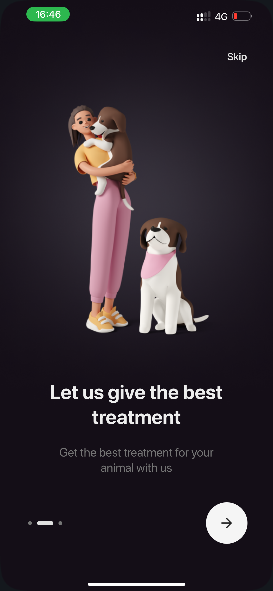
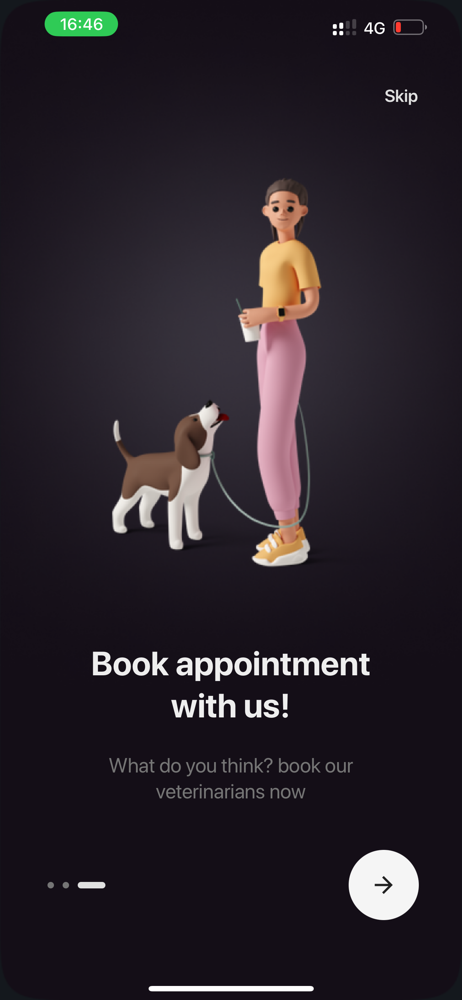

## PetCare Onboarding Screens

---

### Prerequisites

1. Node v16+
2. [NVM](http://nvm.sh/) - optional
3. [Expo Go](https://docs.expo.dev/get-started/expo-go/) - install on mobile phone/emulator

### Covered in this project

- Animations - React Native Reanimated ([react-native-reanimated](https://docs.expo.dev/develop/user-interface/animation/))
- Theming - Restyle ([@shopify/restyle](https://shopify.github.io/restyle/))
- Fonts - Expo Fonts ([expo-font](https://docs.expo.dev/develop/user-interface/fonts/))
- React Native Safe Area Context ([react-native-safe-area-context](https://docs.expo.dev/versions/latest/sdk/safe-area-context/))
- Typescript

This project was developed on Node v18.19.0, with:

- [yarn](https://classic.yarnpkg.com/lang/en/docs/install/) as the package manager.
- [nvm](http://nvm.sh/) as the node provider
- [Expo](https://docs.expo.dev/get-started/installation/) & [Expo Go](https://docs.expo.dev/get-started/expo-go/)

### Resources

Figma Design File - https://www.figma.com/file/pSpLrpkd1TKxbYV3p2UOvL/Onboardings---Pet-Care-App-(Community)?type=design&node-id=57-483&mode=design&t=gAXgeDumHEKRaPlG-0

### Screenshots

